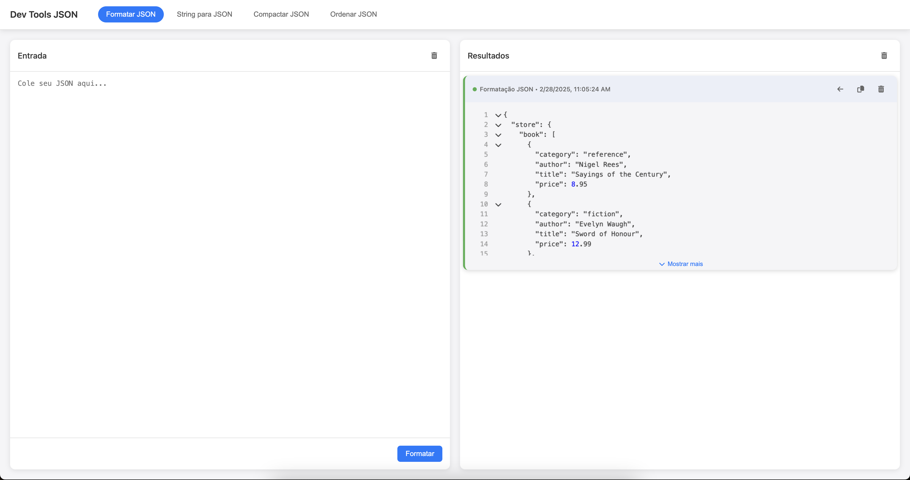

# Dev Tools JSON

Uma extensão para o Chrome que oferece ferramentas avançadas para manipulação e visualização de JSON, com interface intuitiva e recursos poderosos.

## Funcionalidades

A extensão Dev Tools JSON oferece várias ferramentas para trabalhar com dados JSON:

### 1. Formatar JSON
- Transforma JSON compacto em um formato legível com indentação adequada
- Visualização avançada com numeração de linhas
- Colapso/expansão de objetos e arrays aninhados
- Destaque de sintaxe colorido

### 2. String para JSON
- Converte strings JSON escapadas em objetos JSON formatados
- Remove aspas extras e caracteres de escape
- Visualização com os mesmos recursos avançados da formatação

### 3. Compactar JSON
- Compacta JSON formatado em uma única linha
- Útil para economizar espaço ou preparar para transmissão

### 4. Ordenar JSON
- Ordena todas as propriedades do JSON em ordem alfabética crescente
- Ordenação recursiva (afeta todos os objetos aninhados)
- Mantém a estrutura original do JSON

## Recursos Adicionais

- **Histórico de Operações**: Mantém um histórico das últimas 50 operações realizadas
- **Reutilização de Resultados**: Permite usar qualquer resultado anterior como nova entrada
- **Cópia para Área de Transferência**: Copia resultados com um clique
- **Remoção Individual**: Remove itens específicos do histórico
- **Persistência**: Salva o histórico mesmo após fechar o navegador
- **Interface Responsiva**: Design limpo e intuitivo

## Instalação

### Método 1: Instalação a partir da Chrome Web Store (Em breve)
1. Acesse a [Chrome Web Store](https://chrome.google.com/webstore)
2. Pesquise por "Dev Tools JSON" ou acesse o link direto (a ser adicionado)
3. Clique em "Adicionar ao Chrome"
4. Confirme a instalação quando solicitado

### Método 2: Instalação Manual (Modo Desenvolvedor)
1. Faça o download ou clone este repositório para o seu computador
2. Abra o Chrome e navegue até `chrome://extensions/`
3. Ative o "Modo do desenvolvedor" no canto superior direito
4. Clique em "Carregar sem compactação"
5. Selecione a pasta onde você baixou/clonou a extensão
6. A extensão será instalada e aparecerá na barra de ferramentas do Chrome

## Como Usar

1. Clique no ícone da extensão na barra de ferramentas do Chrome para abrir a aplicação
2. Selecione a operação desejada na barra de navegação superior
3. Cole ou digite o JSON na área de entrada
4. Clique no botão "Processar" (ou o nome específico da operação)
5. O resultado será exibido no painel de saída e adicionado ao histórico

### Dicas de Uso

- **Colapso/Expansão**: Clique nos ícones de seta ao lado das chaves e colchetes para colapsar ou expandir seções do JSON
- **Mostrar Mais/Menos**: Para resultados grandes, use o botão "Mostrar mais" para expandir a visualização
- **Reutilização**: Clique na seta para a esquerda em qualquer resultado para usá-lo como nova entrada
- **Limpeza**: Use o ícone de lixeira para limpar a entrada ou todo o histórico

## Requisitos

- Google Chrome versão 88 ou superior
- Não são necessárias permissões especiais além do acesso básico

## Privacidade

Esta extensão:
- Não coleta nenhum dado do usuário
- Não envia informações para servidores externos
- Armazena dados apenas localmente no seu navegador
- Não requer conexão com a internet para funcionar

## Contribuição

Contribuições são bem-vindas! Se você encontrar bugs ou tiver sugestões de melhorias:

1. Abra uma issue descrevendo o problema ou sugestão
2. Envie um pull request com suas alterações
3. Siga as diretrizes de código e estilo do projeto

## Licença

Este projeto está licenciado sob a [MIT License](LICENSE).

## Autor

Desenvolvido por Lindemberg Andrade

---

Para suporte ou mais informações, entre em contato através de [bergwylhame@gmail.com] 